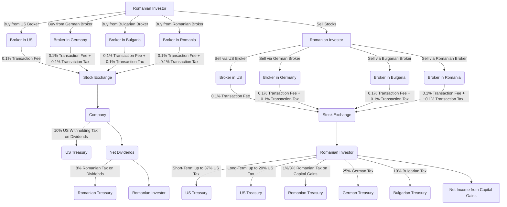

# Taxes

private talk - https://chatgpt.com/c/5b750bcd-3a77-4c0f-8273-b1f021691ee2

```mermaid
flowchart TD
    A[Romanian Investor] -->|Buy from US Broker| B(Broker in US)
    A -->|Buy from German Broker| C(Broker in Germany)
    A -->|Buy from Bulgarian Broker| D(Broker in Bulgaria)
    A -->|Buy from Romanian Broker| E(Broker in Romania)

    B -->|0.1% Transaction Fee| F(Stock Exchange)
    C -->|0.1% Transaction Fee + 0.1% Transaction Tax| F(Stock Exchange)
    D -->|0.1% Transaction Fee + 0.1% Transaction Tax| F(Stock Exchange)
    E -->|0.1% Transaction Fee + 0.1% Transaction Tax| F(Stock Exchange)

    F --> G(Company)
    G -->|10% US Withholding Tax on Dividends| H(US Treasury)
    G --> I(Net Dividends)
    I -->|8% Romanian Tax on Dividends| J(Romanian Treasury)
    I --> K(Romanian Investor)

    A -->|Sell Stocks| L
    L[Romanian Investor] -->|Sell via US Broker| M(Broker in US)
    L -->|Sell via German Broker| N(Broker in Germany)
    L -->|Sell via Bulgarian Broker| O(Broker in Bulgaria)
    L -->|Sell via Romanian Broker| P(Broker in Romania)

    M -->|0.1% Transaction Fee| Q(Stock Exchange)
    N -->|0.1% Transaction Fee + 0.1% Transaction Tax| Q(Stock Exchange)
    O -->|0.1% Transaction Fee + 0.1% Transaction Tax| Q(Stock Exchange)
    P -->|0.1% Transaction Fee + 0.1% Transaction Tax| Q(Stock Exchange)

    Q --> R(Romanian Investor)
    R -->|Short-Term: up to 37% US Tax| S(US Treasury)
    R -->|Long-Term: up to 20% US Tax| T(US Treasury)
    R -->|1%/3% Romanian Tax on Capital Gains| U(Romanian Treasury)
    R -->|25% German Tax| V(German Treasury)
    R -->|10% Bulgarian Tax| W(Bulgarian Treasury)
    R --> X(Net Income from Capital Gains)
```
