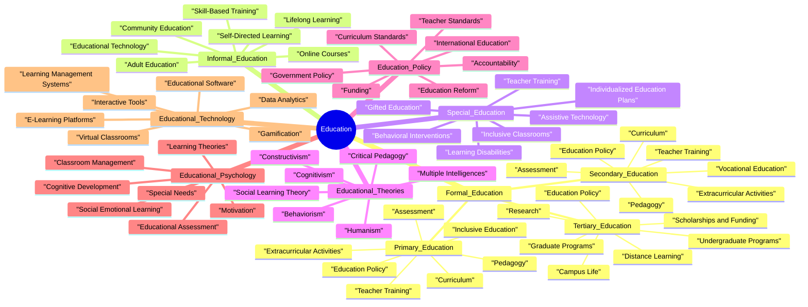

# Education

```mermaid
mindmap
  root(("Education"))
    Formal_Education
      Primary_Education
        "Curriculum"
        ::icon(fa fa-book)
        "Assessment"
        ::icon(fa fa-check)
        "Pedagogy"
        ::icon(fa fa-chalkboard-teacher)
        "Extracurricular Activities"
        ::icon(fa fa-football-ball)
        "Inclusive Education"
        ::icon(fa fa-universal-access)
        "Teacher Training"
        ::icon(fa fa-chalkboard)
        "Education Policy"
        ::icon(fa fa-balance-scale)
      Secondary_Education
        "Curriculum"
        ::icon(fa fa-book)
        "Assessment"
        ::icon(fa fa-check)
        "Pedagogy"
        ::icon(fa fa-chalkboard-teacher)
        "Extracurricular Activities"
        ::icon(fa fa-football-ball)
        "Vocational Education"
        ::icon(fa fa-toolbox)
        "Teacher Training"
        ::icon(fa fa-chalkboard)
        "Education Policy"
        ::icon(fa fa-balance-scale)
      Tertiary_Education
        "Undergraduate Programs"
        ::icon(fa fa-graduation-cap)
        "Graduate Programs"
        ::icon(fa fa-user-graduate)
        "Research"
        ::icon(fa fa-flask)
        "Distance Learning"
        ::icon(fa fa-laptop)
        "Campus Life"
        ::icon(fa fa-university)
        "Scholarships and Funding"
        ::icon(fa fa-money-bill-wave)
        "Education Policy"
        ::icon(fa fa-balance-scale)
    Informal_Education
      "Self-Directed Learning"
      ::icon(fa fa-user)
      "Community Education"
      ::icon(fa fa-users)
      "Lifelong Learning"
      ::icon(fa fa-infinity)
      "Online Courses"
      ::icon(fa fa-laptop)
      "Educational Technology"
      ::icon(fa fa-robot)
      "Skill-Based Training"
      ::icon(fa fa-tools)
      "Adult Education"
      ::icon(fa fa-user)
    Special_Education
      "Learning Disabilities"
      ::icon(fa fa-brain)
      "Gifted Education"
      ::icon(fa fa-star)
      "Inclusive Classrooms"
      ::icon(fa fa-chalkboard)
      "Individualized Education Plans"
      ::icon(fa fa-file-alt)
      "Assistive Technology"
      ::icon(fa fa-wheelchair)
      "Behavioral Interventions"
      ::icon(fa fa-child)
      "Teacher Training"
      ::icon(fa fa-chalkboard-teacher)
    Educational_Theories
      "Constructivism"
      ::icon(fa fa-puzzle-piece)
      "Behaviorism"
      ::icon(fa fa-hand-paper)
      "Cognitivism"
      ::icon(fa fa-brain)
      "Humanism"
      ::icon(fa fa-heart)
      "Social Learning Theory"
      ::icon(fa fa-users)
      "Critical Pedagogy"
      ::icon(fa fa-book)
      "Multiple Intelligences"
      ::icon(fa fa-lightbulb)
    Education_Policy
      "Government Policy"
      ::icon(fa fa-landmark)
      "Curriculum Standards"
      ::icon(fa fa-book)
      "Funding"
      ::icon(fa fa-money-bill-wave)
      "Accountability"
      ::icon(fa fa-check-circle)
      "Education Reform"
      ::icon(fa fa-recycle)
      "Teacher Standards"
      ::icon(fa fa-chalkboard-teacher)
      "International Education"
      ::icon(fa fa-globe)
    Educational_Psychology
      "Learning Theories"
      ::icon(fa fa-brain)
      "Cognitive Development"
      ::icon(fa fa-child)
      "Motivation"
      ::icon(fa fa-bullseye)
      "Classroom Management"
      ::icon(fa fa-chalkboard-teacher)
      "Educational Assessment"
      ::icon(fa fa-check)
      "Special Needs"
      ::icon(fa fa-wheelchair)
      "Social Emotional Learning"
      ::icon(fa fa-heart)
    Educational_Technology
      "E-Learning Platforms"
      ::icon(fa fa-laptop)
      "Interactive Tools"
      ::icon(fa fa-tools)
      "Learning Management Systems"
      ::icon(fa fa-cogs)
      "Virtual Classrooms"
      ::icon(fa fa-chalkboard-teacher)
      "Gamification"
      ::icon(fa fa-gamepad)
      "Educational Software"
      ::icon(fa fa-code)
      "Data Analytics"
      ::icon(fa fa-chart-bar)
```
