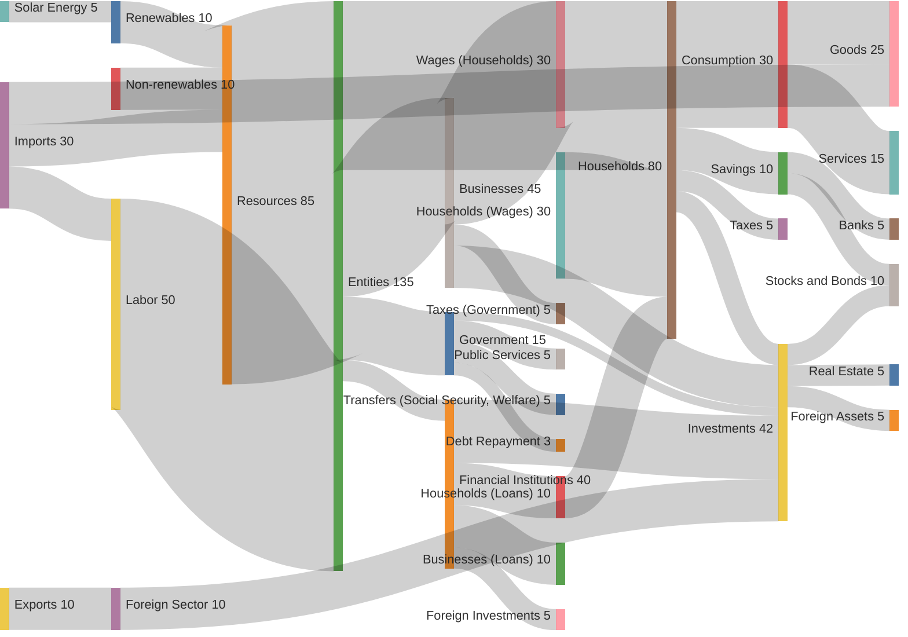

# Money sankey diagram

```mermaid
---
config:
  sankey:
    showValues: true
    width: 1000
    height: 700
    linkColor: '#a1a1a1' # source, target, gradient, #a1a1a1
    nodeAlignment: 'center' # left, center, right, justify
---
sankey-beta

%% source,target,value
"Renewables","Resources",10
"Non-renewables","Resources",10
"Solar Energy","Renewables",5
"Resources","Entities",85
"Labor","Entities",50
"Imports","Labor",10
"Imports","Resources",10
"Imports","Goods",10
"Entities","Households",40
"Entities","Businesses",30
"Entities","Government",15
"Entities","Financial Institutions",5

"Households","Consumption",30
"Consumption",Goods,15
"Consumption",Services,15
"Households","Savings",10
"Households","Investments",5
"Households","Taxes",5
"Businesses","Wages (Households)",30
"Businesses","Taxes (Government)",5
"Businesses","Investments",10
"Government","Public Services",5
"Government","Transfers (Social Security, Welfare)",5
"Government","Debt Repayment",3
"Government","Investments",2
"Financial Institutions","Households (Loans)",10
"Households (Loans)","Households",10
"Households (Wages)","Households",30
"Financial Institutions","Businesses (Loans)",10
"Financial Institutions","Investments",15
"Exports","Foreign Sector",10
"Foreign Sector","Investments",10
"Financial Institutions","Foreign Investments",5
"Savings","Banks",5
"Savings","Stocks and Bonds",5
"Investments","Stocks and Bonds",5
"Investments","Real Estate",5
"Investments","Foreign Assets",5
```
